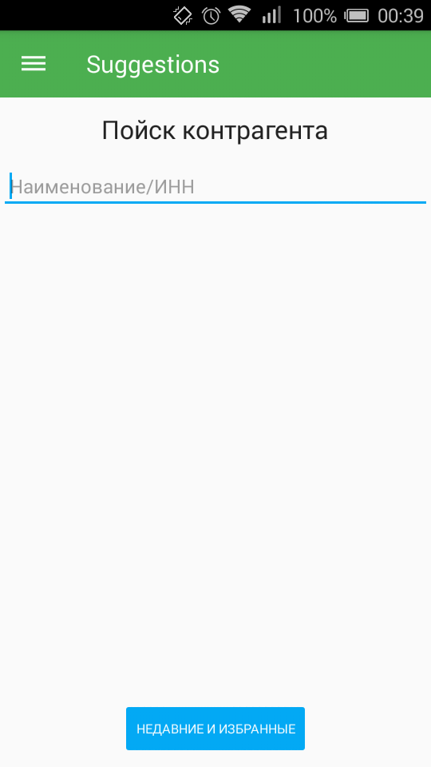
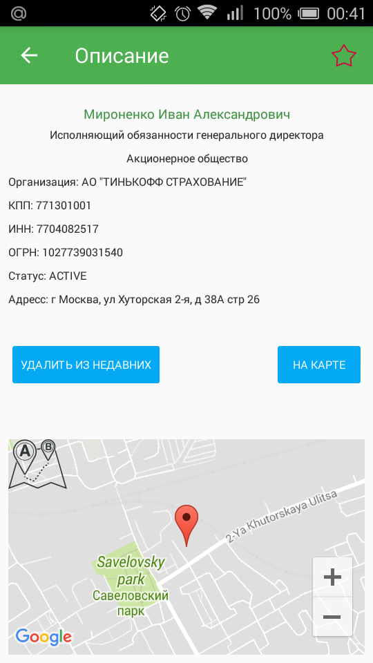
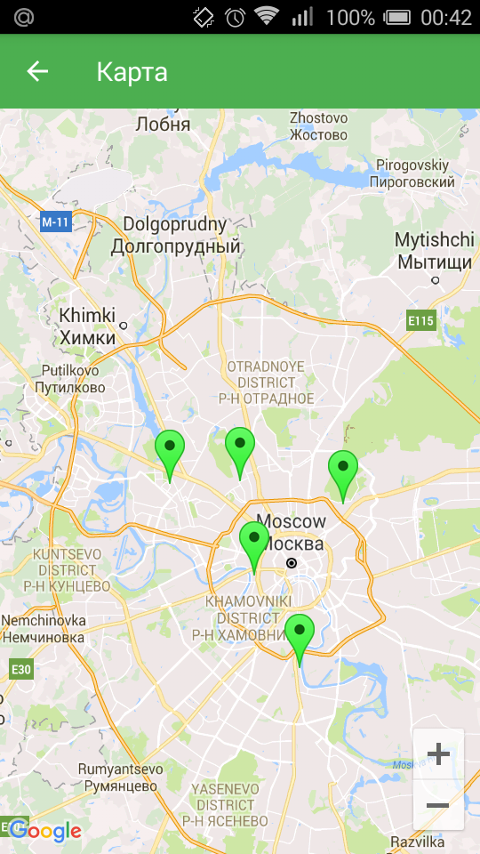

Приложение пойск по контрагенту

Данные с ресурса ​ https://dadata.ru (предоставляет API)

Демонстрация интересубщего объекта на карте + детальное описание.
Возможность сохранения историии пойска, отметить объекты как избранные

